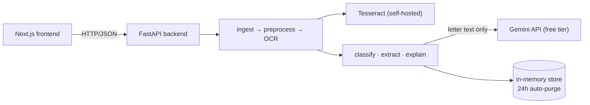

# BriefPilot

Upload a photo or PDF of a German official letter (Finanzamt, Ausländerbehörde, Krankenkasse,
Bußgeld, Rundfunkbeitrag, Jobcenter, rental/utility) and get: the text read via a real OCR pipeline,
structured fields extracted with a confidence and a source location for each, a plain-English
explanation grounded only in the letter itself, a deadline-sorted action checklist, and a
click-a-field-to-highlight-it-in-the-scan viewer — the whole thing proving the AI didn't invent
anything, not just claiming it didn't.

It runs entirely on free infrastructure (self-hosted Tesseract OCR, Google Gemini's free tier, no
hosted deployment — see [ADR-0001](docs/adr/0001-local-first-zero-cost-demo-strategy.md)) and stores
nothing longer than 24 hours, with no account required (see [`/privacy`](frontend/src/app/privacy/page.tsx),
[ADR-0009](docs/adr/0009-retention-in-process-asyncio-sweep.md)).

See [PROGRESS.md](PROGRESS.md) for exactly what's built, [docs/ARCHITECTURE.md](docs/ARCHITECTURE.md)
for how it fits together, and [docs/adr/](docs/adr/) for why each non-obvious decision was made.

## What's actually built (M1–M24)

- **OCR with word-level bounding boxes** — ingestion (PDF/image) → deskew/contrast preprocessing →
  Tesseract, normalized to one schema (`{text, page, bbox, confidence}` per word) from day one
- **A quality gate** that asks for a retake on an unreadable photo instead of showing garbled text
- **Classification** into 8 letter types, **structured extraction** (sender, dates, amount, legal
  references, required actions) with **provenance** — every field links back to the OCR words it
  came from, or honestly says it couldn't be matched
- **Deterministic validators** (date ordering, sign, a curated § whitelist) that flag impossible
  values without silently rewriting them
- **A grounded, ≤200-word plain-English explanation**, with a second, independent check
  (`advice_linter.py`) that the model's actual output never slips into legal advice
- **Click-to-highlight**: tap any extracted field, see its exact bounding box drawn on your original
  scan
- **One-click delete + 24h auto-purge**, verified — the delete button re-checks the job is actually
  gone before claiming success, not just that the request didn't error
- **An eval harness** (`eval/`) scoring extraction against 5 outcomes (correct / correct-null /
  missed / wrong / hallucinated), not a pass/fail boolean — currently blocked on real golden letters
  to score against, honestly reported rather than faked
- **Hardening**: per-IP rate limiting, streaming upload size guards, structured request logging,
  prompt-injection defense-in-depth on every LLM call

## Architecture



Full request lifecycle, layering, and the anti-hallucination design (null-not-guess, provenance,
deterministic validation) are in [docs/ARCHITECTURE.md](docs/ARCHITECTURE.md) — worth reading before
the code if you want the "why," not just the "what."

## Quick start (native — the tested path)

No Docker required. This is what's actually been run and verified throughout development.

**Prerequisites:** Python 3.13+, Node.js 22+, and [Tesseract OCR](https://github.com/tesseract-ocr/tesseract)
with the German language pack:

```bash
# Windows: installer at https://github.com/UB-Mannheim/tesseract/wiki, then add to PATH
# macOS
brew install tesseract tesseract-lang
# Debian/Ubuntu
sudo apt install tesseract-ocr tesseract-ocr-deu
```

```bash
# Backend — terminal 1
cd backend
python -m venv .venv
.venv\Scripts\activate        # Windows
# source .venv/bin/activate   # macOS/Linux
pip install -r requirements-dev.txt
cp .env.example .env          # add a free GEMINI_API_KEY — see below
uvicorn app.main:app --reload
```

```bash
# Frontend — terminal 2
cd frontend
npm install
cp .env.example .env
npm run dev
```

Open `http://localhost:3000`. Backend health check: `http://localhost:8000/health`.

Without a `GEMINI_API_KEY`, everything still works — OCR, the quality gate, upload/delete — the
result's `doc_type`/`extraction`/`explanation` just stay `null` (null-not-guess, not a crash).

### Get a free Gemini key

No billing account needed: <https://aistudio.google.com/apikey>. Paste it into `backend/.env` as
`GEMINI_API_KEY`. Free tier is capped (roughly 20 requests/day at the time of writing) — plenty for a
demo, not for load testing.

### Testing on a real phone (same Wi-Fi)

`NEXT_PUBLIC_API_URL` is baked in at build time, so `localhost` in `frontend/.env` means the phone
itself, not your computer. Point both at your machine's LAN IP instead:

```bash
# frontend/.env
NEXT_PUBLIC_API_URL=http://<your-lan-ip>:3000
# backend/.env
CORS_ORIGINS=http://<your-lan-ip>:3000
```

Then open `http://<your-lan-ip>:3000` on the phone's browser. A production build
(`npm run build`) needs rebuilding after changing `NEXT_PUBLIC_API_URL`; `npm run dev` picks up a
restart.

## Docker Compose (present, not the verified path)

`docker-compose.yml` and both `Dockerfile`s exist and describe the plan's original architecture,
including a Postgres container. **The backend doesn't actually connect to Postgres** — job/document
storage is in-memory only (a deliberate simplification, see docs/ARCHITECTURE.md's "Known deviation:
Postgres"), so the Docker path hasn't been the one actually exercised this project. Treat
`make dev` / `docker compose up --build` as present-but-unverified until it's specifically re-checked
(tracked for M28's fresh-machine README test) — the native path above is the one to trust.

## Running the test suite

```bash
cd backend && pytest                    # 245 tests, ~7s
cd frontend && npm run test:e2e         # 6 Playwright specs, real rendered app, all backend calls mocked
```

`make ci` runs everything CI runs (lint, typecheck, tests, frontend build) in CI's order, without
Docker.

## AI provider configuration

The backend never calls a provider SDK outside `backend/app/services/ai/` — everything else depends
on the `AIService` interface and resolves a concrete adapter through `get_ai_service()`. Switch
providers with one env var, no code changes:

| Variable | Used when |
|----------|-----------|
| `AI_PROVIDER` | `gemini` (default — free tier), `openai`, or `azure_openai` |
| `GEMINI_API_KEY`, `GEMINI_MODEL` | `AI_PROVIDER=gemini` — free key, no billing account: <https://aistudio.google.com/apikey> |
| `OPENAI_API_KEY`, `OPENAI_MODEL` | `AI_PROVIDER=openai` (paid — opt-in only, per the zero-cost mandate) |
| `AZURE_OPENAI_API_KEY`, `AZURE_OPENAI_ENDPOINT`, `AZURE_OPENAI_DEPLOYMENT`, `AZURE_OPENAI_API_VERSION` | `AI_PROVIDER=azure_openai` (paid — opt-in only) |

Adding a new provider means one adapter class under `app/services/ai/providers/` and a branch in
`app/services/ai/factory.py` — see
[docs/ARCHITECTURE.md](docs/ARCHITECTURE.md#ai-provider-abstraction-dependency-inversion).

## Coding standards

**Python** (backend): `black`, `ruff`, `isort`, `mypy --strict` (every function/class/schema fully
typed). `pre-commit` (via `make install`) runs formatters/linters on staged files; mypy/pytest stay in
CI (`make ci`) — a slow commit hook gets bypassed with `--no-verify`, and a bypassed hook protects
nothing.

```bash
cd backend
black app && ruff check app --fix && isort app && mypy app && pytest
```

**TypeScript** (frontend): ESLint + Prettier (`prettier-plugin-tailwindcss` for class sorting).

```bash
cd frontend
npm run lint && npm run format
```

## CI/CD

`.github/workflows/ci.yml` on every push/PR to `main`:

- **frontend**: `npm ci` → lint → `format:check` → build → Playwright e2e
- **backend**: install → ruff → black → isort → mypy → pytest → eval fast subset

No deployment step — intentional, not an omission. See
[ADR-0001](docs/adr/0001-local-first-zero-cost-demo-strategy.md).

## Project documentation

| File | Purpose |
|------|---------|
| [PROGRESS.md](PROGRESS.md) | Milestone tracker (M1–M30), status, and known deviations |
| [BACKLOG.md](BACKLOG.md) | Scope-freeze register: what's deliberately out, and why |
| [LEARNING.md](LEARNING.md) | Decisions log and milestone-by-milestone reviews |
| [docs/adr/](docs/adr/) | Architecture Decision Records — the "why," written the day each decision was made |
| [docs/ARCHITECTURE.md](docs/ARCHITECTURE.md) | Request lifecycle, layering, the anti-hallucination design |
