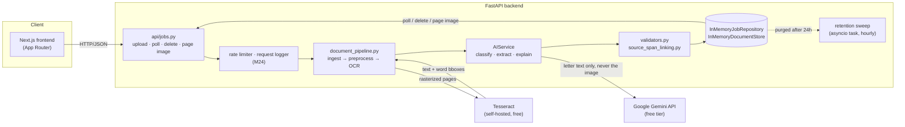

# Architecture Overview

BriefPilot is two independently deployable applications — a Next.js frontend and a FastAPI
backend — with no database in front of them today. That last part is a deliberate deviation from
the original plan (see "Known deviation: Postgres" below), not an oversight.



Everything under `Backend` runs in a single Python process; there is no message queue, no cache
layer, no separate worker service. `ThreadPoolExecutor` (in `services/job_service.py`) runs the
pipeline off the request path so upload returns immediately with a `processing` job the frontend
polls — that's the entire concurrency story.

## Request lifecycle: upload → result

1. `POST /api/v1/jobs` — validated (content type, bounded-chunk size read, rate limit), stored as a
   `processing` `Job`, raw bytes handed to `InMemoryDocumentStore` immediately (so the original scan
   is viewable even before OCR finishes), and the real work is submitted to a background thread.
2. In the background: `services/document_pipeline.py` rasterizes the file (`pypdfium2`), preprocesses
   it (`services/preprocess.py`: grayscale → deskew → contrast → downscale), then runs
   `TesseractOcrService`, producing an `OcrDocument` — word-level text with fractional bounding boxes,
   the schema every later stage depends on (frozen by ADR-0002).
3. `services/quality.py` gates on word count and mean OCR confidence. Too weak → the job ends
   `low_quality` and the frontend shows a retake prompt, deliberately **without** the unreliable text.
4. Three independent, best-effort AI calls run against the real `AIService` (Gemini by default):
   classification (letter type), extraction (`LetterExtraction` — sender, dates, amount, legal refs,
   required actions, each with a confidence), and explanation (a ≤200-word, grounded-only plain-English
   summary). Any one of the three can fail (missing key, quota, network) without failing the job —
   the corresponding field just stays `null`.
5. `services/source_span_linking.py` matches each extracted value back to the real OCR words it came
   from (or leaves it unlinked, with confidence capped, not zeroed). `services/validators.py` then
   runs deterministic checks (deadline ≥ letter date, amount ≥ 0, § references against a curated
   whitelist) — a failure downgrades confidence and appends a machine-readable code; it never rewrites
   the value.
6. The job flips to `done`. `GET /api/v1/jobs/{id}` (polled every 1.2s by the frontend) and
   `GET /api/v1/jobs/{id}/pages/{n}` (the raw scan, for the click-to-highlight viewer) serve the
   result. `DELETE /api/v1/jobs/{id}` removes both the job and the raw bytes on request; a background
   sweep does the same to anything older than 24h regardless.

## Backend layering

| Layer            | Responsibility                                                             |
|-------------------|-----------------------------------------------------------------------------|
| `api/`            | HTTP routing — request/response, size/rate guards, no business logic       |
| `schemas/`        | Pydantic contracts — simultaneously the extraction contract, validation shape, and API response type (CLAUDE.md §4) |
| `services/`       | Business logic: the pipeline, AI abstraction, validators, retention, rate limiting |
| `repositories/`   | Data access — `JobRepository`, `DocumentStore`, both in-memory today        |
| `core/`           | Cross-cutting concerns (structured logging)                                |
| `config/`         | Environment-driven settings (`pydantic-settings`)                          |

A new feature is additive: a schema, a service, optionally a repository, a router that wires them
together. Existing modules are untouched — this held true across every milestone that shipped code
from M1 through M24.

## AI provider abstraction (dependency inversion)

External AI providers are interchangeable infrastructure, never a dependency the rest of the app
codes against directly:

```
app/services/ai/
├── base.py                      AIService — the abstract contract:
│                                   classify_document, extract_document, explain_document
├── factory.py                   get_ai_service() — reads Settings.ai_provider, builds the adapter
├── json_parsing.py              Shared, provider-agnostic JSON extraction (tolerates leading/
│                                   trailing prose — real models don't always honor "JSON only")
├── classification_parsing.py    Shared, pure response parser (no provider, no network)
├── extraction_parsing.py         "
├── explanation_parsing.py        "
├── prompts/                     classify.py, extract.py, explain.py + shared
│                                   wrap_untrusted_content()/UNTRUSTED_CONTENT_INSTRUCTION (M24)
└── providers/
    ├── gemini_service.py         GeminiService(AIService) — the default, free-tier provider
    ├── openai_service.py         OpenAIService(AIService) — paid, opt-in only
    └── azure_openai_service.py   AzureOpenAIService(AIService) — paid, opt-in only
```

- **`AIService`** is an `ABC` with three operations, each in terms of typed Pydantic DTOs
  (`app/schemas/ai.py`, `classification.py`, `extraction.py`). Nothing outside `services/ai/` imports
  a provider SDK directly.
- **`GeminiService`** is the default (CLAUDE.md §3's zero-cost mandate; ADR-0003). Switching provider
  is one environment variable (`AI_PROVIDER`) — no code changes, no router/service touched.
- **`get_ai_service()`** is called lazily, once per job, not at app startup — a missing API key
  surfaces as a caught exception in `JobService`'s best-effort AI steps, not a crash on boot or on
  every unrelated upload. It is deliberately **not** `@lru_cache`'d (a real bug found and fixed this
  project: a cached async client reused across different event loops raised `RuntimeError: Event
  loop is closed`).
- Adding a new provider means one more adapter class here — nothing else changes.

## Validation and provenance (the anti-hallucination spine)

This is the part of the system CLAUDE.md treats as non-negotiable, and the part most worth reading
if you're evaluating the engineering, not just the feature list:

- **Null-not-guess.** Every `ExtractedField[T]` is `{value, confidence, source_span, validation_issues}`.
  A field the model isn't confident about is `null`, never a plausible-looking guess — enforced in
  the prompt *and* the parser.
- **Provenance.** `source_span_linking.py` matches each value back to real OCR word bounding boxes.
  An unlinked value's confidence is capped (never zeroed — a value can be real but just not
  auto-locatable) and the frontend's `DocumentViewer` shows an explicit "could not be matched, verify
  manually" prompt rather than pretending to point somewhere.
- **Deterministic validators**, not model self-checking: `validators.py` runs plain Python checks
  (date ordering, sign, a curated § whitelist) against the model's own output. Failures are flagged,
  never silently corrected.
- **Grounded explanation**, enforced twice: the prompt instructs "ground only in the given text," and
  `advice_linter.py` independently scans the model's *actual output* for advice-phrase patterns
  ("you should", "I recommend") — the second check doesn't trust the first to have worked.
- **Eval suite as a feature.** `eval/scoring.py` scores every field against one of five outcomes
  (correct / correct-null / missed / wrong / hallucinated) — not a pass/fail boolean, so "the model
  honestly said null" is distinguishable from "the model invented a value." `eval/run_eval.py` runs
  the real pipeline against `eval/golden/manifest.json`; the golden set itself is real letters only,
  never fabricated (see `eval/golden/README.md`) — it currently has 0 entries, honestly reported by
  `scorecard.md` rather than faked.

## Hardening (M24)

- **Rate limiting**: an in-memory, per-IP sliding-window limiter (`services/rate_limiter.py`) on the
  two state-changing endpoints (upload, delete).
- **Size guards**: uploads are read in bounded 1 MiB chunks, rejecting an oversized body without ever
  fully receiving it.
- **Structured request logging**: one `http_request` log line per request (method, path, status,
  duration, client IP) through the same `structlog` pipeline used everywhere else — never the
  request/response body.
- **Prompt-injection defense-in-depth**: the letter's OCR'd text is delimited and the model is
  explicitly instructed never to treat it as instructions, in all three prompts. This is a mitigation,
  not a guarantee — the deterministic output-side checks above remain the actual backstop.

## Frontend layering

| Folder         | Responsibility                                                        |
|----------------|-------------------------------------------------------------------------|
| `app/`         | Routes (App Router): landing, `/result/[id]`, `/privacy` — thin, composition only |
| `components/`  | Presentational UI: `UploadForm`, `ExtractionSummary`, `DocumentViewer`, `DeleteButton`, ... |
| `lib/`         | Framework-agnostic utilities: `bbox.ts` (fractional bbox → CSS %), `confidence.ts`, `checklist.ts`, `glossary.ts` |
| `services/`    | `api.ts` — the only place `fetch` is called                            |
| `types/`       | TypeScript types mirroring the backend's Pydantic schemas by hand      |

The one non-obvious piece: `DocumentViewer` renders the field-highlight overlay using CSS percentage
positioning driven directly by the backend's fractional `BBox` (`x, y, width, height` all `0.0–1.0`,
frozen by ADR-0002) — correct at any render size, zero pixel math on the client.

## Known deviation: Postgres

CLAUDE.md §4 names Postgres 16 (JSONB for per-type fields) as the decided datastore. In practice,
`JobRepository` and `DocumentStore` have been in-memory (`InMemoryJobRepository`,
`InMemoryDocumentStore`) since M2/M18 and remain so through M24 — `backend/requirements.txt` has no
Postgres driver, and `Settings.database_url` is a dead field nothing reads. `docker-compose.yml`
still provisions a Postgres container the app never connects to.

This wasn't a silent drift: in-memory storage is what makes the 24h auto-purge and one-click delete
(M22, ADR-0009) simple and fully verifiable, and it's consistent with running as a single free,
unhosted process (ADR-0001). It does mean **all data is gone on every restart**, which is a stronger
privacy property than the 24h ceiling promises, not a weaker one (see the `/privacy` page,
`frontend/src/app/privacy/page.tsx`). Migrating to
real Postgres is tracked as a Production Feature in `BACKLOG.md`, not something this MVP needs.

## CI/CD

`.github/workflows/ci.yml` runs on every push/PR: `frontend` job (lint → format:check → build →
Playwright e2e) and `backend` job (ruff → black → isort → mypy --strict → pytest → eval fast subset).
Deployment is intentionally not configured — see ADR-0001.
